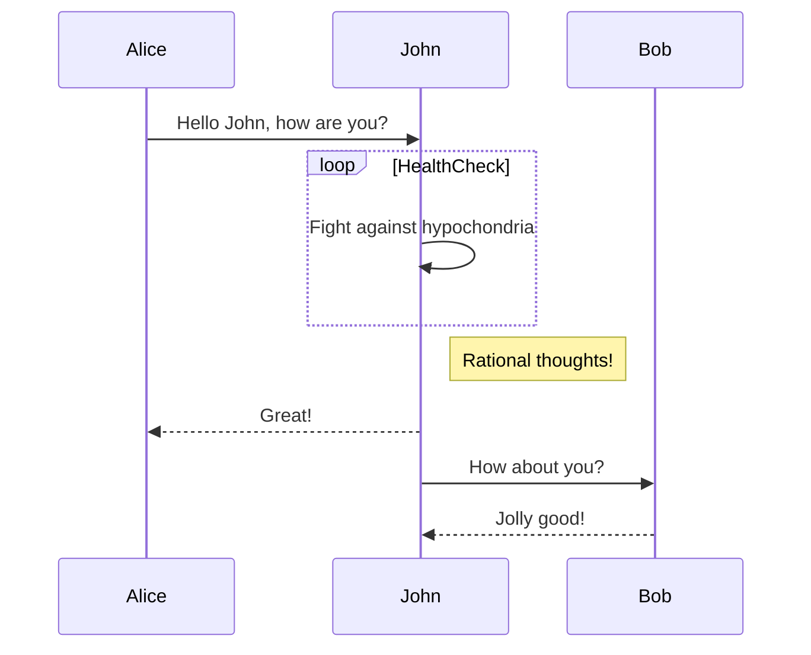

# Example From [Mermaid](https://github.com/mermaid-js/mermaid?tab=readme-ov-file#sequence-diagram-docs---live-editor)

```mermaid
sequenceDiagram
Alice->>John: Hello John, how are you?
loop HealthCheck
    John->>John: Fight against hypochondria
end
Note right of John: Rational thoughts!
John-->>Alice: Great!
John->>Bob: How about you?
Bob-->>John: Jolly good!
```